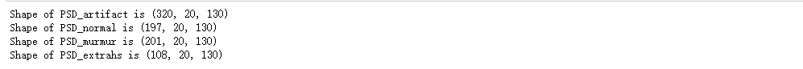

In heart disease diagnosis, heartbeat sounds plays an important role. Irregular heartbeats are caused by abnormal blood flow, which may significantly raise the possibility of heart-related problems. Therefore, heartbeat sound is one of the most common methods in screening of cardiac pathologies. However, in the past years, this task is performed manually using stethoscopes, which is human labor intensive. In addition, as irregularity in heartbeat sounds in nature can be hard to distinguish by human ears, false negative/positive cases are very common.

This project is to create a classifier for different heartbeat sounds using machine learning. The data inputs are soundware files of heartbeat sounds, recorded in various environments. The dataset has 4 categories: artificial sounds (not heartbeat sounds), normal heartbeats, murmur heartbeats, and extra heartbeats. Here, murmur heartbeats and extra heartbeats are two common heartbeat irregularities. Original datasets can be found in: http://www.peterjbentley.com/heartchallenge/

Before doing machine learning on the datasets, some preprocessing are needed to simply the problem and enhance learning quality.

First, the original soundwave files are not of the same length. The average time duration is around 9 seconds. While a doctor may require 9 seconds of sampling to make diagnosis, a machine may need fewer than 3 repititions (i.e., heartbeats) to acquire reasonable understanding. Therefore, every soundwave file is divided into sample frames of 3 seconds, with hop time = 1 second. Since the sample rate = 22050 Hz, 3 seconds means an array of 66150 elements. As a result, we have got 320 artificial sound samples, 197 normal heartbeat sound samples, 201 murmur sound samples and 108 extra heartbeat sound samples.

Figure: loaded files

Second, the classifier studies heartbeat sounds, which is commonly located in frequency region around 50 Hz, in the case of murmur heartbeat, the abnormal blood flow sound is still less than 100 Hz. Therefore, by setting up a bandpass filter of 20 - 150 Hz, one can atenuate and eliminate background noise. After the data noise cleanup, it reduces unnecessary confusions to the classifier.

Figure: sample waveform before filtering

Figure: sample waveform after filtering

Third, we choose to study on spectrogram instead of the time domain waveform. This is because time domain waveform has 66150 elements for each sample, which is too large to handle and may lower efficiency. By converting to a spectrogram, note that the data has previously passed a filter with 150 Hz cutoff frequency, therefore, we only need to investigate frequency regions that is lower than 200 Hz. 200 Hz means a frequency ratio around 0.02 (wich gives 220 Hz). In other words, we can significantly reduce the data size while still keeping the key identities for the classifier. In choosing the parameters of the spectrogram, we set frame size to be 2048, hop length = 512 and frequency ratio, as stated before, to be 0.02. This gives us a 2D tensor of 20 x 130 for each sample.

Figure: spectrogram data

FIgure: the waveform and the corresponding spectrogram of a sample data

Finally, the data are combined, shuffled and splitted into train, validation and test sets.

Figure: records of combining, shuffling and splitting the data

In order to train on the processed data. We note that the 1-D sound wave signal is now fully converted to a 2-D spectrogram of 20 x 130 in size, which is, from another viewpoint, a picture of 2600 pixels. In ohter words, the previous sound wave classification has now become image classification, which gives good reason for us to utilize convolutional neural network. The CNN model is setup in the following way.

Figure: the CNN model summary

As a result, the classifier has reached around 95% accuracy in the validation tests, and acquired 87.5% in the test sets.

Figure: the training process and the test results
